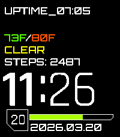

# 2077

A futuristic Pebble watch face inspired by Cyberpunk 2077.
Forked from [moddedBear/pebble-2077](https://github.com/moddedBear/pebble-2077) to add Pebble Time 2 support + a bunch of other features

## Download
- [GitHub releases](https://github.com/bentemple/pebble-2077/releases/latest)

## Features
- Customizable Progress Bar
    - Battery
    - Steps as % of goal
    - Sleep as % of goal
- Step counter
- Current weather
- Fully customizable top and bottom text
    - Date and time formatting
    - Show how many hours you have been awake
- Hourly vibration alert
- Bluetooth disconnect alert

All features are configurable from the Pebble app using Clay for a completely offline configuration.
